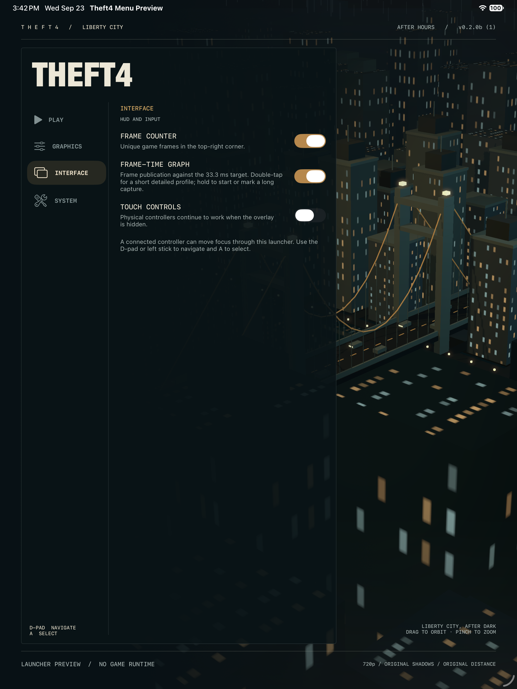
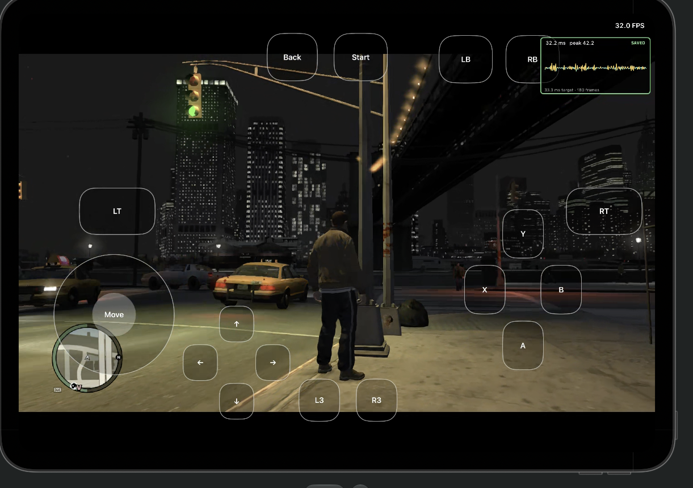

> **Thank you to everyone behind the unprecedented work on
> [LibertyRecomp](https://github.com/OZORDI/LibertyRecomp) and the
> [ReXGlue SDK](https://github.com/rexglue/rexglue-sdk).** Without their
> foundation, Theft4 would have taken much, much longer to reach this point.
> Please support their projects and the upstream developers who made this work possible.

<p align="center">
  
</p>

**SUBMIT your custom device log here: [Theft4 Tester Log & Bug Submission](https://docs.google.com/forms/d/e/1FAIpQLScZNq2hjni8wgChCYl1oaRdJU0XPsVLFWwmVtqYxnIQ708t7A/viewform?usp=publish-editor)**

Help improve Theft4 on your device: capture a slow or problematic scene with the
built-in **short performance capture**, export the saved log, and upload it with
your survey answers and screenshots. Smooth runs are useful comparisons too.
**[Follow the capture, export, and submission instructions below.](#capture-and-submit-a-short-performance-log)**

# Theft4

Theft4 is an experimental, title-specific static ahead-of-time recompilation of
the Xbox 360 release of Grand Theft Auto IV for ARM64 iOS and iPadOS. The
original PowerPC game instructions are translated to C++ ahead of time and
compiled into the signed application. Theft4 does not generate or download CPU
code at runtime and does not require a JIT entitlement.

This is not a source port and it is not a complete Xbox 360 emulator. It combines
ahead-of-time translated game code with a compatibility runtime that recreates
the Xbox services the title expects. The 0.2.1 iOS release promotes the latest
native-renderer, launcher, save-transfer, and diagnostic work into the official
app. It presents through Vulkan, MoltenVK and Metal. The official app and
TestFlight build use `com.lukebrosious.theft4`.

> [!WARNING]
> Theft4 0.2.1 remains experimental. Dense scenes, extended play, physics,
> heat and device compatibility still need testing. The GitHub IPA is an
> unsigned sideload package; TestFlight uses a separately signed build.

## What changed in 0.2.1

This important update adds safer device-specific graphics limits, save backup
and restore, a redesigned launcher, and substantially better performance
evidence collection. It also includes renderer work that reduces redundant CPU,
GPU, pipeline, buffer, constant, and synchronization overhead without lowering
the default image quality on newer devices. See the
[complete 0.2.1 release notes](docs/RELEASE_0.2.1.md).

| Area | Substantial change | Effect |
| --- | --- | --- |
| Command delivery | Batched producer-to-worker transfer, tighter queue locks, bounded storage reuse and compact state packets instead of full draw packets for common state changes | Less allocation, copying and lock waiting under dense command loads. |
| Redundant state | Skip identical binding notifications and repeated vertex/index binds after validating resource identity; reuse immutable vertex-layout requirements | Avoid work that leaves GPU state unchanged while retaining draw order and resource ownership. |
| Shader constants | Reuse validated parent snapshots and apply only changed ranges into fenced frame allocations | Avoid whole-block materialization and byte conversion for small updates. |
| Textures | Separate texture content identity from sampling state; cache verified generations and limit A19 stage walks to shader-used slots | Reduce decode, hashing, upload planning and unused-stage traversal while still validating dirty resources. |
| Pipelines and worker | Bound A19 prewarming, defer draws whose new pipeline is compiling, and record worker phases and queue pressure | Reduce avoidable stalls and make remaining hitches diagnosable. Newly visited areas still need visual checks. |
| Frame lifetime | Two completion-owned native frame slots and bounded resource retirement | Preserve CPU/GPU overlap while protecting in-flight buffers and textures. |
| Device safety | iPhones and iPads with less than 7 GiB of usable memory are capped at 900p + FSR and conservative pressure-heavy settings; lower 540p/720p choices remain available | Reduce rendering and memory pressure on 6 GB and older devices while leaving newer devices unchanged. |
| Graphics and launcher | Stable centered 16:9 gameplay, plus Native Pixels and 540p/720p/900p/1080p, independent FSR, and expanded quality controls | Avoid the world, shadow and HUD distortion found in the withdrawn device-aspect experiment while keeping quality/performance choices explicit. |
| Saves | Validated export and import with an automatic pre-import backup | Move or protect saves without copying the whole app container. |
| Output and power controls | Independent resolution/FSR choices, fixed output policy where appropriate, Game Mode declaration, and conservative defaults for limited-memory profiles | Let testers tune quality against sustained speed, heat, and memory pressure. |
| Diagnosis | Frame-time graph, lightweight long trace, 120-sample detailed GPU/CPU capture spread across about 360 submitted frames, resource inventory checkpoints, and Files export | Produce more concrete pipeline, buffer, GPU-pass, CPU-stage, queue, memory, and thermal evidence with lower capture overhead. |

One useful instrumented comparison is the M5 iPad build 32 to 33 command
transfer change at 900p. Mean renderer interval fell from 40.57 to 37.84 ms,
p95 from 47.58 to 45.58 ms, and intervals over 40 ms from 357/599 to 182/599.
Mean batch-transfer time fell from 4.53 to 0.16 ms and queue-lock wait from
7.40 to 1.54 ms. The routes and GPU work differed, so the whole-frame numbers
are directional rather than a controlled speedup. The targeted transfer and
lock spans show the clearest improvement. See the
[build 33 review](docs/lab-experiments/build33-device-review.md).

Later heavy scenes still miss the 33.3 ms target. An A19 iPhone Air capture in
serious thermal state had a 44.5 ms median renderer interval versus 33.2 ms
in a different, mostly nominal run. The scenes and output sizes differed as
well. We cannot yet claim a measured temperature reduction or locked 30 FPS.
Lower resolution reduces planned pixel work, while the CPU changes reduce
measured command overhead. Same-route, same-settings play after warmup is needed
to measure sustained frame times, comfort and battery use. See the
[A19 capture review](docs/lab-experiments/build40-a19-air-two-capture-review.md)
and [0.2.1 release notes](docs/RELEASE_0.2.1.md).

### Capture and submit a short performance log

#### Which file do we need?

Upload the **`Theft4-Performance-Capture-<date-and-time>.txt`** file created by
**System → Download Latest Log Capture** after a short capture has finished.
This is Theft4's own diagnostic export—not an Apple crash report, a save export,
or just a screenshot of the graph. **The game does not need to crash.**

The short capture records **120 detailed samples across roughly 360 submitted
frames**, including renderer CPU/GPU timing and counters. Expensive resource and
process-memory inventories are sampled at capture start and then periodically,
not every frame. The exported text bundle includes available profile data,
runtime/lifecycle logs, the aligned lightweight frame-stage trace, and app/device
information. Upload the whole `.txt` file; you do not need to extract individual
CSV or JSON sections.

#### 1. Enable the graph, then reproduce the issue

1. In the Theft4 launcher, open **Interface** and enable **Frame-Time Graph**.
   Enable **Frame Counter** too, so screenshots include FPS.
2. Note your graphics settings, then press **Play**. Reach the scene you want to
   test before starting the capture: a busy intersection, city overview, driving,
   turning a corner, stutter, or a visual problem. A smooth scene is also useful
   as a baseline.
3. **Double-tap the frame-time graph** to begin the short detailed capture.
   On current builds, this gesture works directly; no System capture switch is
   required. If an older build has a **Detailed performance capture** switch,
   enable that before starting the game, then use the same double-tap gesture.
4. Keep playing the same route or hold the same camera view while it records.
   The graph shows **REC**, then **SAVED** when the profile finishes. At 30 FPS,
   the capture usually takes roughly **12 seconds at 30 FPS**; allow more time
   at lower FPS.
   **Wait for SAVED before closing the app.** If it shows **ERR**, mention that
   in your report; do not describe it as a completed capture.

Capture **while the problem is happening**, not only after it has recovered.
If the issue appears only after the device warms up, reproduce that and report
how many minutes you had been playing. For streaming or first-visit stutters,
start just before entering the affected area and say whether you had visited
it earlier in the session. Avoid changing graphics settings during a comparison.

> Profiling itself adds overhead. Describe how the game felt **before** recording
> as well as during it. Repeat the same scene without recording when judging
> normal performance; a captured FPS reading alone is not a clean benchmark.

#### 2. Save the log to Files

1. Once the graph says **SAVED**, take any useful screenshots. Save your game
   normally if needed—the performance capture does **not** save game progress.
2. Close Theft4 from the app switcher and reopen it to the launcher.
3. Open **System → Download Latest Log Capture**. This packages the saved
   diagnostics; it does not start a new recording.
4. The dated `.txt` is saved automatically under
   **Files → On My iPhone/iPad → Theft4 → Diagnostics**. The share sheet also
   lets you choose **Save to Files** and copy it somewhere convenient, such as
   iCloud Drive.
5. Use the file with the export date/time for this test. Export **before starting
   another game session**, so the runtime context still matches your capture.

There is one short profile per app launch. To record a second test, export the
first, relaunch, and repeat. A successful export alone does not prove that a
new short profile was recorded: wait for **SAVED** during the run first.

#### 3. Fill out the survey and attach the file

1. Open the **[Theft4 Tester Log & Bug Submission survey](https://docs.google.com/forms/d/e/1FAIpQLScZNq2hjni8wgChCYl1oaRdJU0XPsVLFWwmVtqYxnIQ708t7A/viewform?usp=publish-editor)**.
   Sign in to Google if prompted. The form states that your Google account's
   name, email, and photo are recorded when you upload files and submit.
2. In **App log → Add file**, select the exported
   `Theft4-Performance-Capture-….txt` from Files. Wait for the upload to finish.
   The current exporter is bounded to about 50 MB and the form allows up to
   100 MB, so a normal export does not need splitting.
3. Add your username if desired, choose **iPhone** or **iPad**, and press **Next**
   to complete the remaining survey pages. Include the following details in the
   relevant questions or description:

   - Exact device model/chip, iOS/iPadOS version, and Theft4 version/build. Say
     whether it is a TestFlight, sideloaded, or locally installed test build.
   - Scene resolution, FSR and other graphics settings; attach screenshots of
     the **Graphics** page so we can reproduce your configuration.
   - Where you were, what you were doing, the camera direction, and steps to
     reproduce it. Distinguish moving/driving from standing still.
   - FPS/frame-time behavior before and during capture; whether the issue is
     repeatable, improves after waiting, or happens only on a first visit.
   - Time spent playing, whether the device felt hot, charging/battery status,
     and whether Low Power Mode was enabled. Note the approximate point in the
     capture when a noticeable hitch or visual problem occurred.

4. Attach supporting screenshots wherever the survey requests them: the scene
   **with the graph and FPS visible**, your graphics settings, and any visual
   defect or error message. Screenshots supplement the `.txt`; they do not
   replace it. If a screenshot or screen recording was taken during the
   measured interval, mention that because it can affect performance.
5. Review the answers and attachments, then press **Submit** and wait for the
   confirmation. Keep a copy of the log until the report has been investigated.

Do not upload your ISO, extracted game folder, title-update package, or save
files. Review logs/screenshots for personal information before sharing; runtime
logs can contain device details and file paths. If upload fails, keep the
original `.txt` and report the exact error instead of substituting a screenshot
of the log.

<details>
<summary>Screenshot guide: enable the graph and recognize a completed capture</summary>



*Enable Frame-Time Graph under Interface before pressing Play. This is the real
launcher UI in an isolated simulator preview; no game data is loaded.*



*Example gameplay capture: look for SAVED on the graph in the top-right before
quitting to export. Double-tap that graph while the scene you want to diagnose
is visible. This screenshot illustrates the controls; it is not a performance
guarantee for your device or settings.*

</details>

### Move or back up saves with Files

This feature is included in 0.2.1 build 53.

Quit the game and reopen Theft4, then open **System → Export Saves to Files**.
Theft4 copies the saved-game packages and GTA IV profile data into a dated
`Theft4-Saves-…` folder under **Files → On My iPhone/iPad → Theft4 → Save Exports**.
Copy the **entire folder** to iCloud Drive, another device, or another backup
location. To restore, open **System → Import Saves from Files** and select that
`Theft4-Saves-…` folder. Theft4 validates it, asks before replacing data, and
backs up the current saves to **Save Exports** first. Restart the game after
import. Game installation files are not included in save exports.

The historical `com.theft4.m5lab` app has a separate private container; this
feature does not automatically extract its saves. Keep that app until its data
has been transferred or backed up.

## Current status

The following has been demonstrated on a physical ARM64 iPad:

- a development-signed UIKit application containing the statically compiled GTA IV AOT code;
- Xbox guest memory, kernel, threading, filesystem, XEX loading, and TU8 patch application;
- execution reaching and continuing beyond the recompiled title entry point;
- real GTA IV PM4 command processing and on-device Xenos shader translation;
- Vulkan shader and pipeline creation through statically linked MoltenVK;
- a UIKit-owned `CAMetalLayer`, three-image swapchain, and repeated Metal presentation;
- native GameController and RemoteIO integration at the host boundary;
- real XMA decoding, improved audio delivery, and centered 16:9 presentation;
- the full opening 3D sequence and first player-control state in a Release build.

The promoted native renderer has reached gameplay on the M5 iPad. The measured
captures above show real improvement in command delivery, while frame time
still varies substantially in heavy scenes.

The game has visibly booted on the test iPad, but this does **not** mean the port
is complete or generally playable. Broader physical-controller acceptance,
frontend/import UX, correctness, compatibility, performance, and
long-duration stability remain active work.

## Engineering record

### Before starting the game

The **After Hours** launcher places a procedural 3D city and suspension bridge
behind Play / Graphics / Interface / System navigation. Drag the city to change the view.
Its scene and effects are released before the game runtime starts.

**Graphics** offers independent scene resolution and FSR choices, texture
filtering, shadows, draw distance, model detail, reflection quality, edge
smoothing and motion blur. The performance preset starts with 540p + FSR and
conservative quality settings; all controls can be adjusted afterward. Changes
apply at the next game launch. **Interface** provides the FPS counter,
frame-time graph and touch controls. Existing preferences remain in the app
data after an in-place update.
Motion blur applies at the next game launch. Turning it off selects the stock
non-blur composite variant; it does not disable depth of field or the entire
post-processing pass. Device visual/performance acceptance is pending. See the
[motion-blur and fast-driving test plan](docs/THEFT4_MOTION_BLUR_AND_STREAMING.md).

Enable touch controls for
a movement stick, swipe-to-look on empty screen space, Xbox buttons/triggers,
D-pad, and L3/R3. Physical controllers remain supported with either setting.
The compact touch layout is adapted from XeniOS; its attribution and license
are bundled with Theft4. The full XeniOS layout editor is not included.

Touch gameplay and save/reload are still undergoing device verification.
GPU freezes during extended play and app switching are known issues; the
input/display switches do not change renderer stability settings.

The promoted renderer uses two completion-owned native frame slots. Scene
resolution and output mode are selected in Graphics before launch; 720p remains
available. Long-session stability and background/foreground recovery still
need device testing.

The project keeps a detailed public record of implementation work, experiments,
measured outcomes, rejected approaches, and remaining verification:

- [Engineering changelog](CHANGELOG.md) — the running, file-mapped technical record;
- [3D performance execution plan](THEFT4_3D_PERFORMANCE_PLAN.md) — ordered work and
  the latest renderer checkpoint;
- [CPU-first native-renderer audit](docs/THEFT4_CPU_PERFORMANCE_AUDIT.md) — the
  current 1080p city CPU profile, logging/validation costs, safe optimization
  experiments and paced-30 acceptance criteria;
- [Current paced-30 implementation plan](docs/THEFT4_30FPS_IMPLEMENTATION_PLAN.md)
  — ordered CPU optimization passes, tests and keep/revert gates; planned,
  not yet implemented;
- [September 16 GPU diagnosis](THEFT4_GPU_DIAGNOSTIC_2026-09-16.md) — trace-backed
  generic-renderer analysis and experiment design;
- [iOS architecture report](LIBERTYRECOMP_IOS_ARCHITECTURE.md) and
  [implementation plan](LIBERTYRECOMP_IOS_PLAN.md) — the original port audit and
  milestone architecture.

The changelog distinguishes validated defaults from opt-in experiments and
records failed approaches so they are not rediscovered. Private game data,
captures, logs, device identifiers, and signing material are deliberately excluded.

## Architecture

```text
Theft4 UIKit application
        |
        v
Versioned C bridge and iOS lifecycle adapters
        |
        v
LibertyRecomp / ReXGlue compatibility runtime
        |
        +--> statically recompiled GTA IV code (PowerPC -> C++ -> ARM64)
        +--> Xbox kernel, memory, threading, filesystem, input and audio services
        +--> generic Xenos command processor + runtime shader translation
        |
        +--> opt-in GTA-IV-specific renderer + cached native SPIR-V
                                   |
                                   v
                            Vulkan / MoltenVK
                                   |
                                   v
                                 Metal
```

The iOS application owns `UIApplication`/`UIScene`, the visible view and
`CAMetalLayer`, device storage, user interaction, and lifecycle. The runtime is
embedded in-process as statically linked code behind a small C interface.

## No game files are included

This repository contains no ISO, title update, extracted game assets, saves, or
Rockstar Games source code. You must supply files from your own legally obtained
Xbox 360 copy. Do not open issues requesting copyrighted game files, download
links, signature-check bypasses, or prebuilt bundles containing game data.

The currently validated input is the supported USA retail Xbox 360 base and its
matching title update. Input validation is intentionally strict; files accepted
by an emulator are not automatically compatible with this title-specific AOT
build.

## Building

**For normal play, follow [Build and run the Release app](docs/IOS_RELEASE_BUILD.md).**
The generator defaults to optimized **Release**, not the old Debug/core-probe
configuration. This is the same app/runtime source used for the latest on-device
tests, not a second emulator. A fresh-clone end-to-end build is not yet certified;
the external MoltenVK prerequisite is documented explicitly.

Initialize the pinned public dependencies and apply the reviewed dependency
patches:

```sh
git clone --recurse-submodules https://github.com/KoreanSeats1/Theft4.git
cd Theft4
python3 tools/setup_repo.py
python3 tools/setup_repo.py --check
```

On macOS, `Generate-Theft4-Xcode.command` validates the dependencies and
generates the Release Xcode project. Pass your Apple development-team ID as
its optional first argument to configure device signing:

```sh
./Generate-Theft4-Xcode.command YOUR_TEAM_ID
```

The current graphics bring-up expects the documented public MoltenVK archives;
the generator fails with an explicit explanation if they have not been built.
Then follow:

- [iOS core build](docs/IOS_CORE_BUILD.md)
- [iOS application and device build](docs/IOS_APP_BUILD.md)
- [real AOT startup status](docs/IOS_GAME_STARTUP.md)
- [desktop/upstream build guide](docs/BUILDING.md)
- [lawful dumping guide](docs/DUMPING-en.md)

The default Xcode project is generated under `out/build/ios-device-release/`.
Select **Theft4**, your physical device, and **Release**. For normal play,
uncheck **Edit Scheme → Run → Info → Debug executable**, or launch the installed
app directly on the iPad. Leave capture/validation and opt-in diagnostic flags off.
The new guide covers signing, game-file transfer, starting the game, and the
explicit Debug opt-in. CMake files, not generated project build settings, remain
the source of truth.

The GTA-IV-specific renderer is currently an experimental build/launch option,
not the broadly validated default. Its switches, exact measured result, retail
fidelity settings, and fallback behavior are documented in the
[engineering changelog](CHANGELOG.md).

GitHub's automatic source ZIP does not contain the contents of Git submodules.
For a complete checkout, use the recursive clone command above. The release IPA
is deliberately unsigned and must be signed by the user's sideloading tool;
TestFlight distributes a separately Apple-signed build. The application never
contains game files.

## Origins and credits

Theft4 is built on substantial existing open-source work. It began as an iOS
porting branch of [LibertyRecomp](https://github.com/OZORDI/LibertyRecomp) and
preserves that project's Git history and GPL license. The runtime and translation
stack draws heavily from ReXGlue and Xenia; its ahead-of-time approach was
inspired by XenonRecomp; graphics uses XenosRecomp, Vulkan, SPIR-V tooling, and
MoltenVK. FFmpeg, SDL, and numerous smaller libraries are included or referenced
through pinned dependencies.

See [Third-party projects and attribution](docs/ATTRIBUTION.md) and the license
files in each dependency for details. XeniOS was used as an iOS behavior and
debugging reference during bring-up; XeniOS is not embedded as Theft4's runtime.

## License and trademarks

The project-level license is [GPL-3.0](COPYING), inherited from LibertyRecomp.
Vendored and submodule dependencies retain their respective licenses.

Theft4 is an unofficial community research project. It is not affiliated with or
endorsed by Rockstar Games, Take-Two Interactive, Microsoft, Xbox, Apple, or the
maintainers of the upstream projects. Grand Theft Auto, GTA, Xbox, iOS, iPadOS,
Metal, and other names are trademarks of their respective owners.
