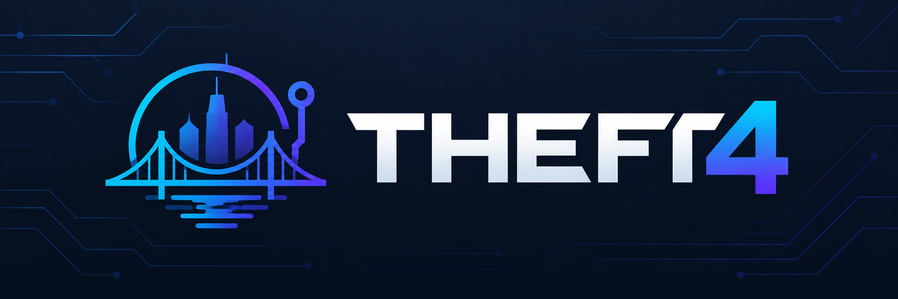
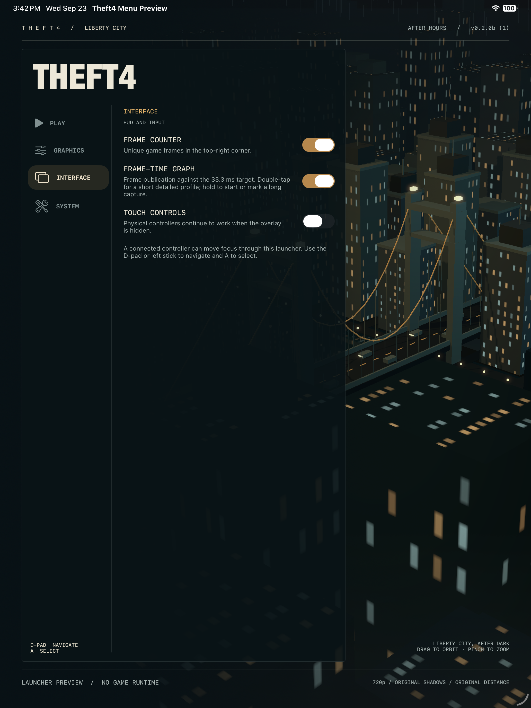
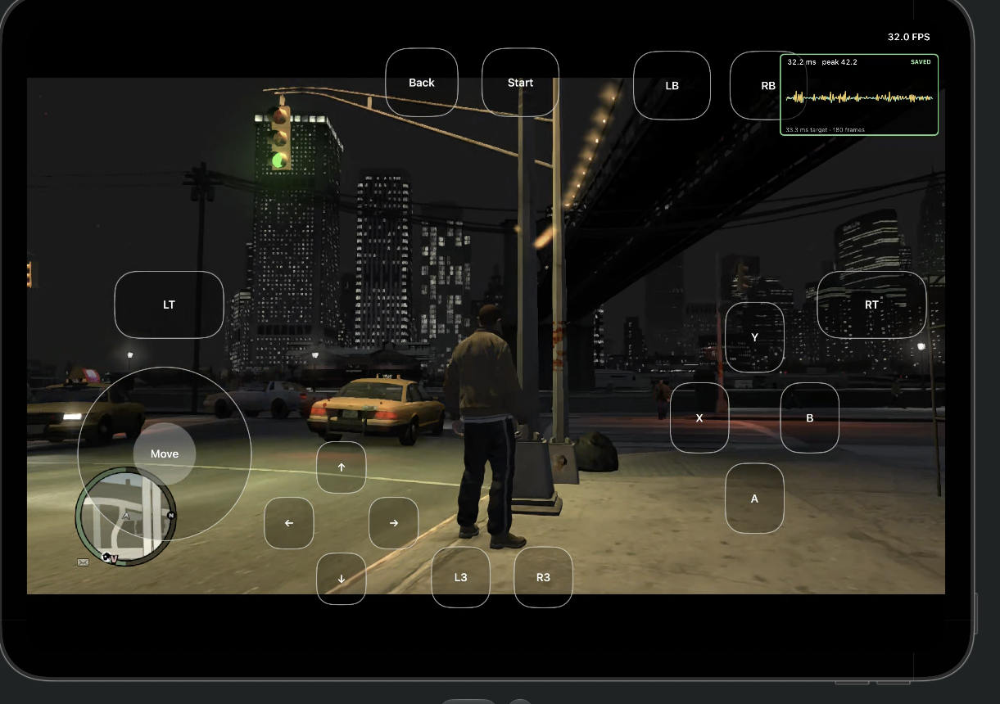

<p align="center">
  <a href="https://www.paypal.com/donate/?hosted_button_id=XSBF9HXAS89EL"></a>
</p>

> **[Support Theft4 via PayPal](https://www.paypal.com/donate/?hosted_button_id=XSBF9HXAS89EL)** — donations help fund continued development and testing.

> **Thank you to everyone behind the unprecedented work on
> [LibertyRecomp](https://github.com/OZORDI/LibertyRecomp) and the
> [ReXGlue SDK](https://github.com/rexglue/rexglue-sdk).** Without their
> foundation, Theft4 would have taken much, much longer to reach this point.
> Please support their projects and the upstream developers who made this work possible.

<p align="center">
  
</p>

**SUBMIT your custom device log here: [Theft4 Tester Log & Bug Submission](https://docs.google.com/forms/d/e/1FAIpQLScZNq2hjni8wgChCYl1oaRdJU0XPsVLFWwmVtqYxnIQ708t7A/viewform?usp=publish-editor)**

Help improve Theft4 on your device: capture a slow or problematic scene with the
built-in **Long Performance Capture**, export the saved log, and upload it with
your survey answers and screenshots. Smooth runs are useful comparisons too.
**[Follow the capture, export, and submission instructions below.](#capture-and-submit-a-performance-log)**

# Theft4

Theft4 is an experimental, title-specific static ahead-of-time recompilation of
the Xbox 360 release of Grand Theft Auto IV for ARM64 iOS and iPadOS. The
original PowerPC game instructions are translated to C++ ahead of time and
compiled into the signed application. Theft4 does not generate or download CPU
code at runtime and does not require a JIT entitlement.

This is an ahead-of-time game recompilation with a compatibility runtime, not a
PC source port or a complete Xbox 360 emulator. **Theft4 0.3** prepares the running
game's frames directly for Metal, including native passes, game-shader bindings,
lighting, reflections, effects and presentation. The game continues to use
LibertyRecomp/ReXGlue's generated-code and runtime foundation. The official app
identity remains `com.lukebrosious.theft4`.

> [!NOTE]
> 0.3 is committed to main. Public IPA/TestFlight publication is a separate step.
> M5 testing reports excellent visuals and a major native-resolution performance
> improvement, with a remaining spike that recovers. The tested native run used
> 2416 × 1359 without upscaling. Locked 30 FPS across every scene/device is not
> established.

## What changed in 0.3

The live direct Metal renderer replaces the previous Vulkan → MoltenVK route for
normal Metal gameplay. Substantial follow-up work rebuilt frame ownership,
geometry conversion, constant preparation, uploads, caches and native draw
encoding. This is the full game renderer, not just the separate Metal Lab.

| Area | Change |
| --- | --- |
| Native graphics | Ordered Metal passes, game shaders, depth/lighting aliases, reflections, host effects and direct drawable presentation. |
| Frame time | Streamed draw encoding, redundant-binding avoidance, shared constants, incremental registry maintenance and completion-owned storage reuse. |
| Geometry | Exact reusable conversion recipes, shared vertex/index allocations, large upload-view reuse and bounded index-range eviction without clearing every mesh. |
| Visual controls | Adjustable sharpening, corrected AA-Off startup, existing resolution/FSR choices, resident LOD and explicit draw-distance profiles. Native Pixels uses a centered 16:9 physical-pixel target. |
| Everyday use | Default-on intro skipping, development telemetry disabled for normal play, optional graphs and bounded captures, preserved saves/settings and Game Mode metadata. |
| Older GPUs | Capability-gated one-time BC-to-ASTC preparation with progress, estimate, resume, cache reuse and confirmed deletion. BC-capable GPUs skip this sweep. |
| Future ports | A source-backed record of the rewritten boundaries, prior costs, fidelity contracts, measurements and title-specific assumptions. |

Read the [complete 0.3 release notes](docs/RELEASE_0.3.md),
[architecture and recompilation lessons](docs/THEFT4_0.3_ARCHITECTURE.md), and
[main integration status](docs/THEFT4_0.3_MAIN_INTEGRATION.md).
The [0.2.1 notes](docs/RELEASE_0.2.1.md) remain the historical public-release record.
Legacy Vulkan code/build dependencies and game compatibility services are retained;
direct Metal does not mean every subsystem has been rewritten from source.

<a id="capture-and-submit-a-short-performance-log"></a>

### Capture and submit a performance log

0.3 uses optimized normal play automatically, with no Retail Mode toggle.
Development logging and probes stay disabled. Optional graphs and Long
Performance Capture are separate choices; recording does not require a crash.

#### 1. Enable capture before Play, then reproduce the issue

1. Open **System → Long Performance Capture** in the launcher and enable it.
   This choice resets Off every time the app opens. It records bounded timings
   for up to five minutes, even when every overlay is hidden.
2. Optionally open **Interface** and enable **Frame-Time Graph** and **Frame
   Counter**. The graph can show recording status and offers capture actions.
3. Note your graphics settings, press **Play**, then drive the route or reach the
   scene you want to test. Record the issue while it happens: a first visit, a
   heavy camera turn, a hitch or a focus transition. Smooth runs are useful too.
4. With the graph enabled, **hold the frame-time graph** to mark a lag spike or
   choose **Stop and save capture**. The recording indicator ends when stopped.
   The capture also stops and saves when the app enters the background, or after
   five minutes. Save your game separately; capture does not save game progress.

The report includes publication intervals, renderer stage timing and bounded
runtime/scheduling observations, along with available configuration and memory
information. Detailed development counters may be absent or zero because the
ordinary optimized policy remains active. Publication timestamps measure frames
handed to the presenter; they are not physical display scanout timestamps.

Capture adds measurement overhead. Describe gameplay before recording as well as
during it, and use the same route/settings without recording when comparing
normal performance. Note app switching, charging, Low Power Mode and how long
the device had been running. Avoid changing graphics settings midway through a
comparison.

#### 2. Export the saved report to Files

1. Stop and save using the graph, or background the app to save, before closing.
   Reopen Theft4 to its launcher if necessary.
2. Open **System → Download Latest Log Capture**. This exports existing data; it
   does not start another recording.
3. The dated **`Theft4-Performance-Capture-<date-and-time>.txt`** is saved under
   **Files → On My iPhone/iPad → Theft4 → Diagnostics**. The share sheet also
   lets you save elsewhere, including iCloud Drive.
4. Upload the complete `.txt`; individual CSV/JSON sections do not need to be
   extracted. Export before starting another test so the latest context matches
   the run. If export reports a failure, retain the app data and report the error.

One long capture is available per app launch. Export the first, reopen, and
explicitly enable capture again for another run. Older releases and engineering
launches also have a short detailed profiler; its double-tap workflow is not the
normal 0.3 capture procedure.

#### 3. Fill out the survey and attach the file

1. Open the **[Theft4 Tester Log & Bug Submission survey](https://docs.google.com/forms/d/e/1FAIpQLScZNq2hjni8wgChCYl1oaRdJU0XPsVLFWwmVtqYxnIQ708t7A/viewform?usp=publish-editor)**.
   Sign in to Google if prompted. The form states that your Google account's
   name, email, and photo are recorded when you upload files and submit.
2. In **App log → Add file**, select the exported
   `Theft4-Performance-Capture-….txt` from Files. Wait for the upload to finish.
   The current exporter is bounded to about 50 MB and the form allows up to
   100 MB, so a normal export does not need splitting.
3. Add your username if desired, choose **iPhone** or **iPad**, and press **Next**
   to complete the remaining survey pages. Include the following details in the
   relevant questions or description:

   - Exact device model/chip, iOS/iPadOS version, and Theft4 version/build. Say
     whether it is a TestFlight, sideloaded, or locally installed test build.
   - Scene resolution, FSR and other graphics settings; attach screenshots of
     the **Graphics** page so we can reproduce your configuration.
   - Where you were, what you were doing, the camera direction, and steps to
     reproduce it. Distinguish moving/driving from standing still.
   - FPS/frame-time behavior before and during capture; whether the issue is
     repeatable, improves after waiting, or happens only on a first visit.
   - Time spent playing, whether the device felt hot, charging/battery status,
     and whether Low Power Mode was enabled. Note the approximate point in the
     capture when a noticeable hitch or visual problem occurred.

4. Attach supporting screenshots wherever the survey requests them: the scene
   **with the graph and FPS visible**, your graphics settings, and any visual
   defect or error message. Screenshots supplement the `.txt`; they do not
   replace it. If a screenshot or screen recording was taken during the
   measured interval, mention that because it can affect performance.
5. Review the answers and attachments, then press **Submit** and wait for the
   confirmation. Keep a copy of the log until the report has been investigated.

Do not upload your ISO, extracted game folder, title-update package, or save
files. Review logs/screenshots for personal information before sharing; runtime
logs can contain device details and file paths. If upload fails, keep the
original `.txt` and report the exact error instead of substituting a screenshot
of the log.

<details>
<summary>Screenshot guide: enable the graph; historical capture indicator</summary>



*Enable Frame-Time Graph under Interface before pressing Play. This is the real
launcher UI in an isolated simulator preview; no game data is loaded.*



*Historical screenshot from the earlier short-profiler workflow. In normal 0.3,
enable Long Performance Capture before Play and hold the graph to mark or stop
the run. The image illustrates graph placement; it is not a performance guarantee.*

</details>

### Move or back up saves with Files

This feature is included in 0.2.1 build 53.

Quit the game and reopen Theft4, then open **System → Export Saves to Files**.
Theft4 copies the saved-game packages and GTA IV profile data into a dated
`Theft4-Saves-…` folder under **Files → On My iPhone/iPad → Theft4 → Save Exports**.
Copy the **entire folder** to iCloud Drive, another device, or another backup
location. To restore, open **System → Import Saves from Files** and select that
`Theft4-Saves-…` folder. Theft4 validates it, asks before replacing data, and
backs up the current saves to **Save Exports** first. Restart the game after
import. Game installation files are not included in save exports.

The historical `com.theft4.m5lab` app has a separate private container; this
feature does not automatically extract its saves. Keep that app until its data
has been transferred or backed up.

## Current status

The following has been demonstrated on a physical ARM64 iPad:

- a development-signed UIKit application containing the statically compiled GTA IV AOT code;
- Xbox guest memory, kernel, threading, filesystem, XEX loading, and TU8 patch application;
- execution reaching and continuing beyond the recompiled title entry point;
- real GTA IV PM4 command processing and on-device Xenos shader translation;
- Vulkan shader and pipeline creation through statically linked MoltenVK;
- a UIKit-owned `CAMetalLayer`, three-image swapchain, and repeated Metal presentation;
- native GameController and RemoteIO integration at the host boundary;
- real XMA decoding, improved audio delivery, and centered 16:9 presentation;
- the full opening 3D sequence and first player-control state in a Release build.

The promoted native renderer has reached gameplay on the M5 iPad. The measured
captures above show real improvement in command delivery, while frame time
still varies substantially in heavy scenes.

The game has visibly booted on the test iPad, but this does **not** mean the port
is complete or generally playable. Broader physical-controller acceptance,
frontend/import UX, correctness, compatibility, performance, and
long-duration stability remain active work.

## Engineering record

### Before starting the game

The **After Hours** launcher places a procedural 3D city and suspension bridge
behind Play / Graphics / Interface / System navigation. Drag the city to change the view.
Its scene and effects are released before the game runtime starts.

**Graphics** offers independent scene resolution and FSR choices, texture
filtering, shadows, draw distance, model detail, reflection quality, edge
smoothing and motion blur. The performance preset starts with 540p + FSR and
conservative quality settings; all controls can be adjusted afterward. Changes
apply at the next game launch. **Interface** provides the FPS counter,
frame-time graph and touch controls. Existing preferences remain in the app
data after an in-place update.
Motion blur applies at the next game launch. Turning it off selects the stock
non-blur composite variant; it does not disable depth of field or the entire
post-processing pass. Device visual/performance acceptance is pending. See the
[motion-blur and fast-driving test plan](docs/THEFT4_MOTION_BLUR_AND_STREAMING.md).

Enable touch controls for
a movement stick, swipe-to-look on empty screen space, Xbox buttons/triggers,
D-pad, and L3/R3. Physical controllers remain supported with either setting.
The compact touch layout is adapted from XeniOS; its attribution and license
are bundled with Theft4. The full XeniOS layout editor is not included.

Touch gameplay and save/reload are still undergoing device verification.
GPU freezes during extended play and app switching are known issues; the
input/display switches do not change renderer stability settings.

The promoted renderer uses two completion-owned native frame slots. Scene
resolution and output mode are selected in Graphics before launch; 720p remains
available. Long-session stability and background/foreground recovery still
need device testing.

The project keeps a detailed public record of implementation work, experiments,
measured outcomes, rejected approaches, and remaining verification:

- [Engineering changelog](CHANGELOG.md) — the running, file-mapped technical record;
- [3D performance execution plan](THEFT4_3D_PERFORMANCE_PLAN.md) — ordered work and
  the latest renderer checkpoint;
- [CPU-first native-renderer audit](docs/THEFT4_CPU_PERFORMANCE_AUDIT.md) — the
  current 1080p city CPU profile, logging/validation costs, safe optimization
  experiments and paced-30 acceptance criteria;
- [Current paced-30 implementation plan](docs/THEFT4_30FPS_IMPLEMENTATION_PLAN.md)
  — ordered CPU optimization passes, tests and keep/revert gates; planned,
  not yet implemented;
- [September 16 GPU diagnosis](THEFT4_GPU_DIAGNOSTIC_2026-09-16.md) — trace-backed
  generic-renderer analysis and experiment design;
- [iOS architecture report](LIBERTYRECOMP_IOS_ARCHITECTURE.md) and
  [implementation plan](LIBERTYRECOMP_IOS_PLAN.md) — the original port audit and
  milestone architecture.

The changelog distinguishes validated defaults from opt-in experiments and
records failed approaches so they are not rediscovered. Private game data,
captures, logs, device identifiers, and signing material are deliberately excluded.

## Architecture

```text
Theft4 UIKit application
        |
        v
Versioned C bridge and iOS lifecycle adapters
        |
        v
LibertyRecomp / ReXGlue compatibility runtime
        |
        +--> statically recompiled GTA IV code (PowerPC -> C++ -> ARM64)
        +--> Xbox kernel, memory, threading, filesystem, input and audio services
        +--> generic Xenos command processor + runtime shader translation
        |
        +--> opt-in GTA-IV-specific renderer + cached native SPIR-V
                                   |
                                   v
                            Vulkan / MoltenVK
                                   |
                                   v
                                 Metal
```

The iOS application owns `UIApplication`/`UIScene`, the visible view and
`CAMetalLayer`, device storage, user interaction, and lifecycle. The runtime is
embedded in-process as statically linked code behind a small C interface.

## No game files are included

This repository contains no ISO, title update, extracted game assets, saves, or
Rockstar Games source code. You must supply files from your own legally obtained
Xbox 360 copy. Do not open issues requesting copyrighted game files, download
links, signature-check bypasses, or prebuilt bundles containing game data.

The currently validated input is the supported USA retail Xbox 360 base and its
matching title update. Input validation is intentionally strict; files accepted
by an emulator are not automatically compatible with this title-specific AOT
build.

## Building

**For normal play, follow [Build and run the Release app](docs/IOS_RELEASE_BUILD.md).**
The generator defaults to optimized **Release**, not the old Debug/core-probe
configuration. This is the same app/runtime source used for the latest on-device
tests, not a second emulator. A fresh-clone end-to-end build is not yet certified;
the external MoltenVK prerequisite is documented explicitly.

Initialize the pinned public dependencies and apply the reviewed dependency
patches:

```sh
git clone --recurse-submodules https://github.com/KoreanSeats1/Theft4.git
cd Theft4
python3 tools/setup_repo.py
python3 tools/setup_repo.py --check
```

On macOS, `Generate-Theft4-Xcode.command` validates the dependencies and
generates the Release Xcode project. Pass your Apple development-team ID as
its optional first argument to configure device signing:

```sh
./Generate-Theft4-Xcode.command YOUR_TEAM_ID
```

The current graphics bring-up expects the documented public MoltenVK archives;
the generator fails with an explicit explanation if they have not been built.
Then follow:

- [iOS core build](docs/IOS_CORE_BUILD.md)
- [iOS application and device build](docs/IOS_APP_BUILD.md)
- [real AOT startup status](docs/IOS_GAME_STARTUP.md)
- [desktop/upstream build guide](docs/BUILDING.md)
- [lawful dumping guide](docs/DUMPING-en.md)

The default Xcode project is generated under `out/build/ios-device-release/`.
Select **Theft4**, your physical device, and **Release**. For normal play,
uncheck **Edit Scheme → Run → Info → Debug executable**, or launch the installed
app directly on the iPad. Leave capture/validation and opt-in diagnostic flags off.
The new guide covers signing, game-file transfer, starting the game, and the
explicit Debug opt-in. CMake files, not generated project build settings, remain
the source of truth.

The GTA-IV-specific renderer is currently an experimental build/launch option,
not the broadly validated default. Its switches, exact measured result, retail
fidelity settings, and fallback behavior are documented in the
[engineering changelog](CHANGELOG.md).

GitHub's automatic source ZIP does not contain the contents of Git submodules.
For a complete checkout, use the recursive clone command above. The release IPA
is deliberately unsigned and must be signed by the user's sideloading tool;
TestFlight distributes a separately Apple-signed build. The application never
contains game files.

## Origins and credits

Theft4 is built on substantial existing open-source work. It began as an iOS
porting branch of [LibertyRecomp](https://github.com/OZORDI/LibertyRecomp) and
preserves that project's Git history and GPL license. The runtime and translation
stack draws heavily from ReXGlue and Xenia; its ahead-of-time approach was
inspired by XenonRecomp; graphics uses XenosRecomp, Vulkan, SPIR-V tooling, and
MoltenVK. FFmpeg, SDL, and numerous smaller libraries are included or referenced
through pinned dependencies.

See [Third-party projects and attribution](docs/ATTRIBUTION.md) and the license
files in each dependency for details. XeniOS was used as an iOS behavior and
debugging reference during bring-up; XeniOS is not embedded as Theft4's runtime.

## License and trademarks

The project-level license is [GPL-3.0](COPYING), inherited from LibertyRecomp.
Vendored and submodule dependencies retain their respective licenses.

Theft4 is an unofficial community research project. It is not affiliated with or
endorsed by Rockstar Games, Take-Two Interactive, Microsoft, Xbox, Apple, or the
maintainers of the upstream projects. Grand Theft Auto, GTA, Xbox, iOS, iPadOS,
Metal, and other names are trademarks of their respective owners.
