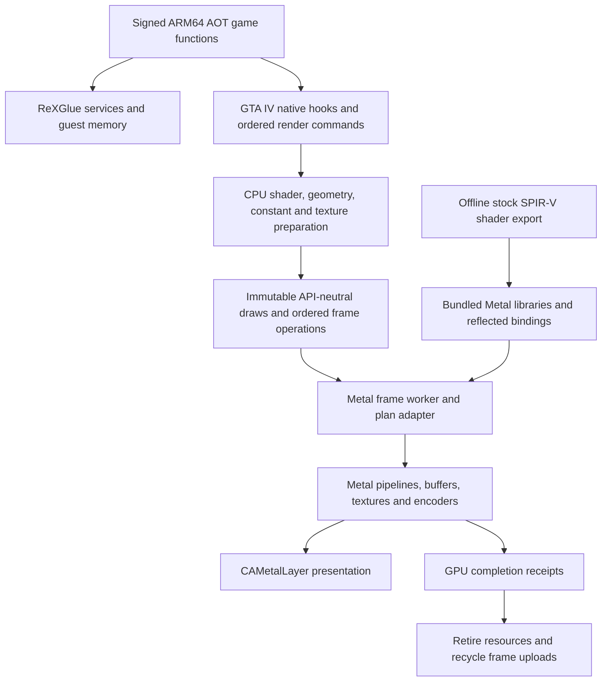

# Theft4 0.3 architecture and recompilation lessons

This record describes the implementation prepared on `codex/direct-metal-96`.
The promotion baseline is main build 94, commit
`b6b4a823403ff38623ce3a46bab369c858c21251`. The preceding build 121 is
`eb9a14619df39f7efbdd6e1bf40aaf5983086948`. Candidate 0.3 is build 122;
its exact source revision belongs in the built app's `Theft4SourceRevision` and
the private artifact manifest. The [change manifest](THEFT4_0.3_CHANGE_MANIFEST.json)
lists the intervening commits and touched source paths.

## Lineage and attribution

LibertyRecomp provides the title-specific ahead-of-time recompilation foundation;
ReXGlue provides runtime, memory, kernel/service and graphics machinery. Theft4
retains that foundation and the generated game functions. It adds the UIKit app,
iOS integration and a substantially different live graphics implementation.
The older [architecture reconnaissance](../LIBERTYRECOMP_IOS_ARCHITECTURE.md)
audited revision `36b729dcc166910c88a2960164707ba9d9e5138c`. It records the original
iOS platform/build gaps and the initial Vulkan bring-up; it is historical, not a
description of 0.3's active renderer.

There are three distinct comparisons:

1. **Original audited LibertyRecomp:** desktop-oriented consumers, generated game
   code and runtime/platform assumptions that required iOS adaptation.
2. **Earlier working Theft4 through main build 94:** a UIKit host and title-specific
   native frontend, with live Vulkan realization over MoltenVK. Many producer,
   constant, save and compatibility improvements already existed here.
3. **0.3:** API-neutral immutable frame preparation followed by a live direct Metal
   worker, native resources/passes/effects and direct presentation, plus successive
   repairs to the early Metal implementation's correctness and performance.

The issues below are attributed to the relevant stage. A regression introduced
during Metal bring-up is not evidence that LibertyRecomp's desktop backend was
incorrect, and a more expensive path on iOS is not automatically an upstream bug.

## The running architecture

`theft4_create_bootstrap_graphics` selects the Metal route on a normal launch in a
Metal-default build. The selected route creates the GTA IV Metal frontend and
frame backend instead of a Vulkan provider/presenter. An explicitly requested
Metal route fails visibly rather than silently testing a fallback renderer.
The 0.3 build entry points now select this route explicitly, even when an old
CMake cache exists. The legacy `vulkan` build remains an explicit comparison.

This is direct Metal **graphics**, not a claim that every retained concept is an
Apple-native source rewrite. Game handles, guest memory layouts, PowerPC register
contexts, compatibility services and some shared Vulkan-shaped CPU recipe types
remain. The build still links legacy dependencies. Offline export uses the stock
SPIR-V representation and SPIRV-Cross; it is not a runtime Vulkan draw layer.

## What was separated, replaced or rewritten

| Area and source | Earlier limitation or cost | 0.3 implementation and reusable lesson |
| --- | --- | --- |
| App/platform boundary: `ios/Theft4`, `ios/bridge`, `ios/CMakeLists.txt` | The original audit found iOS/macOS detection drift, desktop dependencies and no complete CMake-owned UIKit scene shell. Earlier Theft4 solved bring-up but still selected the Vulkan route. | UIKit owns scenes, launcher, device lifecycle and CAMetalLayer; a bridge embeds the runtime. Keep app lifecycle separate from game services and backend realization. This platform work spans earlier releases, rather than originating entirely in 0.3. |
| CPU pipeline/shader preparation: `native_prepared_bindings.h`, `native_shader_realization.h`, `theft4_render_plan_source.cpp` | Preparing title state was coupled to Vulkan shader/module/pipeline realization. Swapping only the presenter could not remove that work. | Preparation produces effective shader identities, interfaces and pipeline recipes before backend allocation. A different backend consumes the same proven CPU meaning without creating unused Vulkan objects. |
| Shader export/catalog: `tools/direct-metal/metal_shader_export.cpp`, `theft4_metal_shader_catalog.cpp`, `theft4_metal_shader_store.mm` | Vulkan descriptor heaps, buffer device addresses and runtime translation are poor interfaces for the desired direct Metal route. | Offline MSL libraries expose constant banks and compact reflected texture/sampler slots. Hash, stage, late-alpha and depth variants have explicit identities. Unknown bindings reject. Keep an immutable shader ABI and verify the complete corpus, rather than guessing descriptor indices. |
| Frame semantics: `theft4_frame_plan.*`, `theft4_metal_frame.mm`, `metal_frame_frontend.inc` | Isolated draw replay did not represent earlier pass contents, resolves, reflections or ordered host effects. Early game bring-up rejected valid scenes at those boundaries. | Ordered frame operations describe attachment roles, draws, resolves, copies and host utilities. Internal submissions retain title-frame continuity and the proper prior content. Port the whole frame dependency graph, not just a draw call. |
| Surface registry: `native_virtual_resource_registry.h`, `native_transactional_map.h`, `native_surface_storage.h` | Registration order, aliased GPU storage and early reflection reads were confused with immutable CPU-uploaded textures. Whole registry copies also cost CPU time. | Versioned virtual resources and journaled changes preserve ordering and commit/abort semantics. Reflection reads depend on written content. Distinguish logical views, immutable source versions and mutable GPU target storage. |
| Native Metal encoder: `theft4_native_metal.*`, `theft4_metal_backend.mm` | Early direct Metal duplicated preparation/ready-draw storage, repeated binding setup and compiled redundant render-pipeline variants. | Bounded frames stream prepared draws into native encoders, reuse unchanged bindings and separate compatible raster pipelines from depth/stencil variants. Removing Vulkan does not itself eliminate application-side duplication. |
| GPU lifetime/cache: `theft4_metal_resources.mm`, `theft4_upload_budget.h`, `theft4_bounded_cache_sweep.h` | Transient constant uploads competed with stable geometry. Strong ownership, unreclaimed upload pages and large maintenance passes could retain work or displace valuable data. | Geometry and constant residency are separated; weak source ownership detects retirement; GPU command receipts retain in-flight objects. Maintenance and eviction are bounded. Reuse storage only after GPU retirement, and account for actual capacities rather than just logical sizes. |
| Constant preparation: `native_masked_constants.h`, `native_metal_constant_projection.h`, `native_metal_shared_constants.h`, `theft4_vector_storage_pool.h` | Repeated projections and whole-bank vector copies spent CPU time even when effective shader inputs were unchanged. | Exact immutable snapshot/projection identities, changed-range materialization, shared bank reuse and bounded CPU/GPU storage pools avoid repeated bytes. Unused banks are omitted only after usage is known; unknown layouts retain the conservative path. |
| Geometry conversion: `native_metal_vertex_conversion.h`, `native_shared_geometry_payload.h`, `metal_draw_frontend.inc` | Early Metal keyed converted vertices by shader/declaration identity and absolute offset, duplicating identical byte transformations. The CPU vector was copied again into an independent draw packet. | Intern exact conversion recipes; canonicalize only whole-record offsets; share the original vector allocation as immutable `render::Bytes`. Preserve crossing layouts and per-draw offsets. Backend-independent conversion meaning is more reusable than an incidental shader hash. |
| Geometry upload memo: `theft4_metal_plan.mm` | Large geometry bypassed the bounded submission memo, and every draw revisited general upload lookup. | Large immutable sources participate; strict owner/version/size checks protect reuse. Single-use data still bypasses unnecessary memo insertion. Measure both shared and unique workloads before adding caching. |
| Index analysis: `theft4_render_plan.cpp` | Build 121 cleared every index-range entry at 8,192 keys, and repeated lowering/admission checks hashed the same full key again. | Build 122 evicts one cold range, preserves hot ranges and borrows the immediately repeated entry. Recency links live in existing map nodes, avoiding a second allocation and full-key copy on insertion. A cheaper hash chooses a bucket; complete identity, generation, conversion, source-size, offset, count, width and view checks still decide correctness. Never use a hash alone as proof of equality. |
| LOD selection: `gta4_lod_selection_policy.h`, `gta4_native_hooks.cpp` | A small frequently used selector executed the generated guest-shaped implementation, while naive distance/LOD overrides risked requesting missing meshes or changing fade semantics. | A native C++ selector preserves threshold precision, strict comparisons, FORCE_HIGH_LOD, missing-resident fallback and published output words. Unusual default blend values use the original function. The game still owns streaming and transitions. Port bounded routines with an independent behavioral oracle. |
| Geometry/topology admission: `theft4_primitive_expansion.cpp`, `metal_draw_frontend.inc` | Early Metal did not support buffered/indexed rectangle expansion, attachmentless draws or all instance inputs. A malformed title draw could make a valid 3D frame fail. | Topology is lowered explicitly, per-stream/index bounds remain checked and malformed draw ranges are isolated. Do not remove checks to hide crashes, or substitute a visibly different primitive. |
| Depth, lighting and color: `native_surface_format.h`, `native_color_output.h`, frame/Metal adapters | Early Metal had reversed-depth, clip-space, packed-lighting/float-pair MRT, channel-mask and target-storage mismatches. | Explicit depth variants, viewport mapping, attachment formats, aliases and color epilogues preserve title intent. Test actual GPU pixels, including blend/discard/coverage behavior, rather than relying only on compilation success. |
| Host effects and output: `theft4_postfx_plan.*`, `theft4_metal_host_shaders.*`, `present_constants.h` | The former Vulkan host shaders and attachment operations did not automatically become valid native Metal passes. | The effects builder and bundled host libraries cover the existing sun/DOF, edge filtering, depth transfer, scaling, FSR/presentation and sharpening operations in order. Cache their pipelines and avoid unnecessary stores only after proving overwrite-before-read. |
| Texture upload/readback: `PrepareNativeMetalFetch`, `native_color_readback.h` | Pitches, dimensions, cropped planes and GPU-generated aliases differ from a simple CPU byte upload. Guest texture locks need coherent title-format bytes. | Preparation preserves mip/slice/swizzle semantics; explicit locks flush and read native GPU storage, then reconstruct validated guest layouts. Normal frame presentation avoids readback. Rare compatibility transfers are explicit synchronization points. |
| BC-incompatible devices: `Theft4TexturePreparation.mm`, `theft4_astc_texture.*` | Unsupported BC formats caused missing/black textures. Repeated expansion to RGBA costs memory, and on-demand conversion can stall gameplay. | Capability-gated static preparation saves ASTC textures once and reuses the result. The full inventory and title texture layouts are GTA IV specific. The general lesson is persistent format preparation keyed to content/capability, not an age-based device blacklist. |
| Diagnostics: `theft4_retail_mode.h`, profiling policy and capture code | Development clocks, inventories, per-frame counters and detailed GPU timing could contaminate ordinary performance. Sparse or misleading timestamps also obscured regressions. | Retail policy is applied before runtime construction and removes development work; diagnostic launch restores opt-in captures. GPU clock calibration, bounded long traces and worker-phase attribution support honest comparisons. Correctness checks remain independent of telemetry. |

## Critical correctness contracts

- **Immutable identity:** an address is not an ownership identity. Recycled addresses,
  new control blocks, generations or conversion metadata must not borrow stale data.
- **View identity:** sharing a source allocation never permits changing draw offsets,
  lengths, index count/width, base vertex or instance requirements. Validate the view
  even on a cache hit.
- **GPU lifetime:** CPU eviction may happen while a submitted draw still uses its
  buffers. Receipts and encoder resource ownership keep those objects alive. Pools
  may recycle only retired storage.
- **Bounded working sets:** CPU conversion variants, conversion recipes, frontend
  packets, index ranges, GPU uploads and transient arenas each have a limit. Raising
  a cache limit is not a substitute for fixing ownership or unwanted competition.
- **Order and content:** mutable targets, logical aliases and reflection resolves
  require ordering. A successful immutable texture upload says nothing about whether
  a GPU-produced target has been written yet.
- **Faithful shaders:** stock shader semantics, precision, output masks and depth
  conventions matter. The build 115 uniform-pointer/depth experiment regressed and
  was reverted. The 0.3 geometry work does not change the rendered geometry bytes.

## Evidence, and what it does not establish

Build 121 passed 26 CPU contracts and, separately in Diagnostic and Retail modes,
45 GPU cases and 32 saved draw replays. GPU lifetime tests retire CPU sources before
completion; conversion tests compare 5,000 randomized layouts and 15,000 suffixes
against the live conservative converter. Build 122 adds index-cache saturation,
hot/cold eviction, complete range parity, owner/version change, bounds and lifetime
checks. These are stronger than a shader-compilation-only test, but are not a
substitute for a complete iPad route or a long-session soak.

Representative **Mac CPU subpath fixtures**, not total-game speedups:

| Change | Baseline → candidate | Scope |
| --- | --- | --- |
| Build 120 large upload-view lookup | 0.552 → 0.384 ms | 128 KiB immutable sources; six interleaved trials. Small-source lookup was effectively unchanged. |
| Build 121 geometry publication | 7.134 → 4.214 ms initial batch; 32 MiB duplicate storage → 0 | 256 × 128 KiB sources, 4,500 lookups/frame. Warm lookup changed 0.0580 → 0.0484 ms. |
| Build 122 index lookup | 0.174 → 0.156 ms | 4,500 draws with two consecutive admissions each; six interleaved trials. Hot-range rescans under saturation: 512 indices → 0. |

The user reports a large improvement in M5 gameplay and a remaining spike followed
by recovery. Routes, settings, cache warmth, focus and thermal state have varied
through development; no aggregate controlled uplift or universal locked-30 result
is established. Sampled renderer CPU spans and the GPU submission envelope are
different measurements and must not be confused with whole-frame elapsed time.

## Applying this work to future recomp ports

Start with a tested game/runtime boundary and an immutable, API-neutral command
contract. Build a small GPU validation lab, then real draw replay, then ordered
frames, then live gameplay. Each stage needs its own claims and tests. A replay
from clear attachments cannot prove a lighting/reflection dependency is correct.

Reuse the architecture patterns: separated preparation/realization; reflected
bindings; bounded owner/version caches; completion-owned storage; incremental
registry maintenance; exact conversion recipes; independent retail policy; and
paired baseline/candidate measurements. The Metal encoder and resource utilities
are candidates for reuse after an interface/ABI audit.

Do not copy GTA IV shader hashes, Xbox title formats, fetch ABI, render-target
alias rules, texture-container inventory, LOD addresses, title hooks or constant
bank layouts into another game as general truth. Those are title-specific.
Likewise, physics, traffic, scripts, animation and the compatibility runtime still
need their own profiles and correctness oracles before native rewrites. They have
not all been replaced by this graphics release.

A future port should also retain the evidence from failed experiments. Direct API
access creates an opportunity; it does not guarantee speed. The substantial win
here came from correcting duplicate work, cache competition, storage roles,
ownership, frame semantics and selected hot routines after the API switch.
